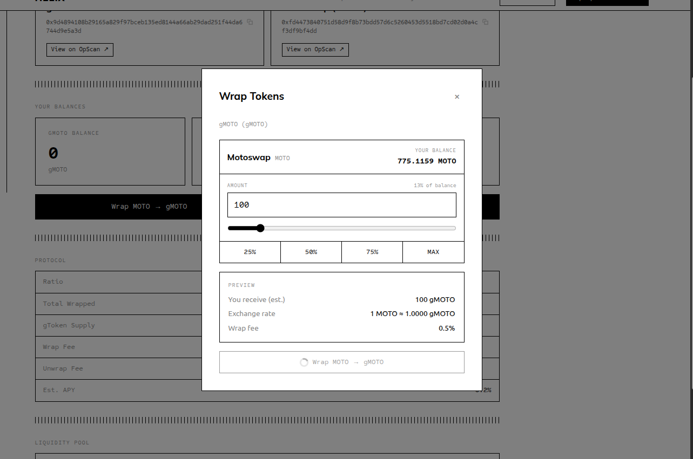
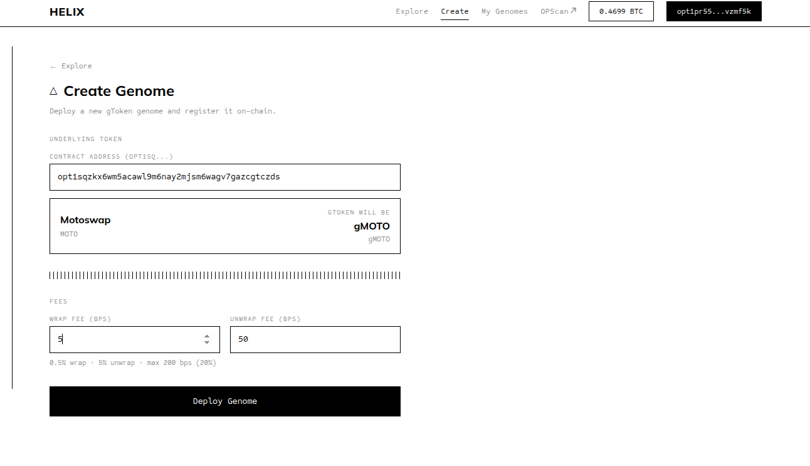
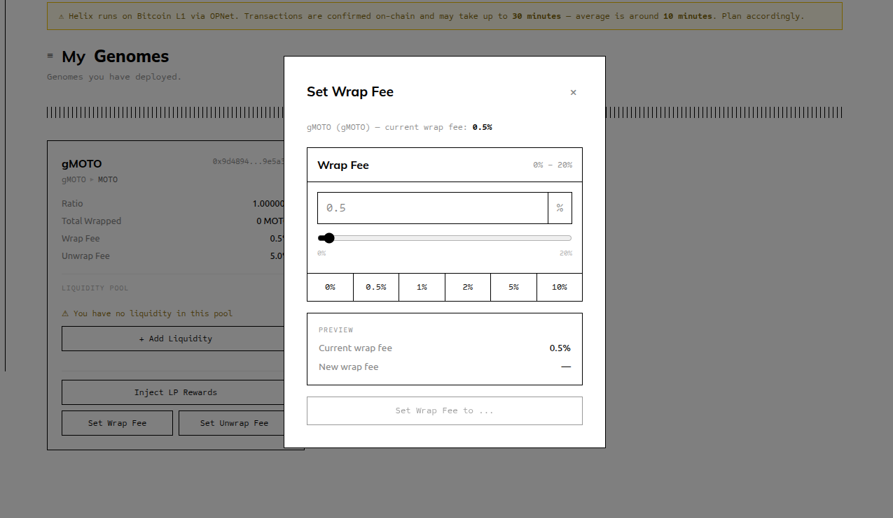

# HELIX — Genome Protocol on OPNet

Yield-bearing token wrappers on Bitcoin L1. Wrap any OP-20 token into a gToken that accrues value passively as fees compound into the redemption ratio.

Built for the **OPNet Vibecoding Challenge** — #opnetvibecode

---

## How It Works

A **Genome** is a smart contract that wraps one OP-20 token and issues a gToken (e.g. MOTO → gMOTO). The ratio between gTokens and the underlying token starts at 1:1 and only ever increases — from wrap fees, unwrap fees, and owner reward injections.

```
ratio = underlyingBalance / gTokenSupply
```

Holding gTokens while the ratio grows is how you earn yield. No staking, no lockups.

---

## Screenshots

**Wrapping tokens** — deposit MOTO, receive gMOTO at the current ratio



**Creating a Genome** — paste any OP-20 address, set fees, deploy in two transactions



**My Genomes** — manage your deployed genomes, add liquidity, inject rewards


**Setting fees** — adjust wrap/unwrap fee (0–20%) at any time



---

## Core Actions

| Action | Who | What it does |
|---|---|---|
| Wrap | Anyone | Deposit underlying → receive gTokens (fee deducted, ratio grows) |
| Unwrap | Anyone | Burn gTokens → receive underlying (fee deducted, ratio grows) |
| Create Genome | Creator | Deploy genome contract + register in Factory + create MotoSwap pool |
| Add Liquidity | Creator | Deposit equal amounts of gToken + underlying into MotoSwap pool |
| Inject Rewards | Creator | Deposit underlying into genome to instantly boost ratio for all holders |
| Set Fees | Creator | Update wrap/unwrap fee rate (0–200 bps, 0–20%) |

> Wrapping is locked until the genome has an active MotoSwap liquidity pool with reserves on both sides.

---

## Architecture

```
Factory (OP_NET)
  └── registry: underlying → genome address
        │
        ▼
  Genome (OP_20)  ←── IS the gToken
    wrap()         deposit underlying, mint gTokens
    unwrap()       burn gTokens, return underlying
    injectRewards()  owner boosts ratio directly
    setWrapFee()   / setUnwrapFee()

MotoSwap AMM pool: gToken ↔ underlying (secondary market)
```

---

## Project Structure

```
helix/
├── contracts/          AssemblyScript smart contracts (compiled to WASM)
│   ├── src/
│   │   ├── genome/     Genome.ts  — gToken wrapper contract (OP_20)
│   │   └── factory/    Factory.ts — genome registry (OP_NET)
│   ├── abis/           Generated ABI JSON files
│   └── scripts/        Deploy and registration scripts
├── frontend/           React + TypeScript + Vite dapp
│   └── src/
│       ├── pages/      Explore, MineDetail, Create, MyGenomes
│       ├── components/ Cards, modals, wallet button
│       └── hooks/      useWallet, useMines, useGenomePoolInfo
└── docs/               VitePress documentation site
```

---

## Running Locally

**Frontend**
```bash
cd frontend
npm install
npm run dev
# → http://localhost:5173
```

**Docs**
```bash
cd docs
npm install
npm run docs:dev
# → http://localhost:5174
```

**Contracts** (build only — requires AssemblyScript)
```bash
cd contracts
npm install
npm run build:genome
npm run build:factory
```

Copy `contracts/.env.example` to `contracts/.env` and fill in your deployer keys before running any scripts.

---

## Deployed Contracts (OPNet Testnet)

| Contract | Address |
|---|---|
| Factory v5 | `opt1sqr560qfrd9czkhtagkslclxaej2qxnryjvzjlws8` |
| MOTO Token | `opt1sqzkx6wm5acawl9m6nay2mjsm6wagv7gazcgtczds` |

---

## Tech Stack

- **Smart contracts** — AssemblyScript → WebAssembly, OPNet Bitcoin L1
- **Frontend** — React, TypeScript, Vite
- **Wallet** — OPWallet via `@btc-vision/walletconnect`
- **DEX** — MotoSwap (OP-20 AMM) for gToken liquidity pools
- **Docs** — VitePress

---

## License

MIT
