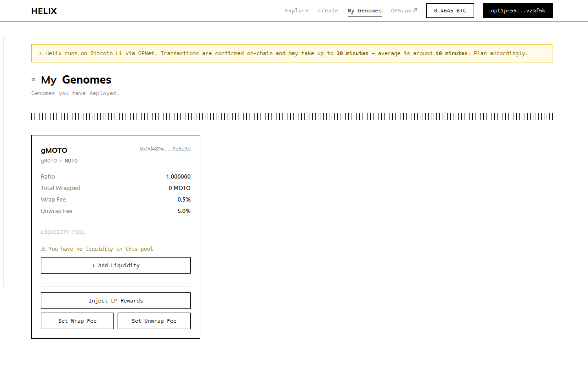

# Creator Overview

Anyone can deploy a Genome for any OP-20 token that does not already have one. Becoming a Genome creator means you are the **owner** of that Genome contract. With ownership come both capabilities and responsibilities.

## What You Can Do as Owner

- **Set and update fees** — You control the wrap fee and unwrap fee for your Genome. You can change them at any time, and changes take effect immediately.
- **Inject rewards** — You can deposit underlying tokens directly into the Genome to increase the ratio for all gToken holders, without minting new gTokens.
- **Manage liquidity** — You provide the initial liquidity on MotoSwap, enabling the secondary market for your gToken.

## Your Three Core Responsibilities

**1. Provide initial liquidity**

Before users can wrap tokens into your Genome, you must create a MotoSwap liquidity pool between your gToken and the underlying token, and add reserves to both sides. Until you do this, the Wrap button is disabled for all users.

**2. Keep fees fair**

The fees you set determine the yield users earn from your Genome. Fees that are too high discourage wrapping; fees that are too low produce little yield. Choose fee rates that are appropriate for the expected activity level and communicate them clearly to your users.

**3. Optionally inject rewards**

If you earn income related to the underlying token (for example, LP trading fees on MotoSwap), you can convert that income back to the underlying token and inject it into your Genome. This grows the ratio for all holders without requiring any user action.

## What You Cannot Do

- You **cannot withdraw** user funds. The underlying tokens locked in the Genome belong to the gToken holders. There is no `ownerWithdraw()` function — the contract does not have one.
- You **cannot mint** gTokens arbitrarily. New gTokens are only minted through the `wrap()` function by users depositing underlying tokens.
- You **cannot change** the underlying token. The underlying is set permanently at deployment time.

::: warning Set up liquidity before announcing your Genome
Wrapping is locked until a liquidity pool with active reserves exists. If you announce your Genome before setting up liquidity, users who try to wrap will see a disabled button. Set up the pool first, then announce.
:::

## Creator Workflow Summary

1. Deploy a Genome at `/create` (two transactions: fund + deploy)
2. Genome auto-registers in the Helix Factory
3. Go to "My Genomes" — your Genome appears there
4. Wrap some underlying tokens to get initial gTokens
5. Add Liquidity using the "Add Liquidity" button (deposits equal amounts of gToken + underlying into MotoSwap)
6. Your Genome is now live — wrapping is open to users
